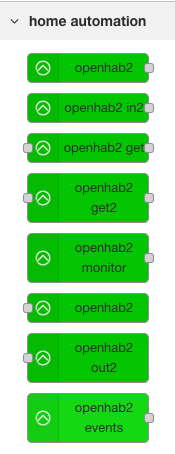

# node-red-contrib-openhab2
## Description

Nodes facilitating the automation of *openHAB* ( <http://www.openhab.org> ) items with Node-RED ( <http://nodered.org> ). This is a fork from Peter De Mangelaere [node-red-contrib-openhab2 package](https://flows.nodered.org/node/node-red-contrib-openhab2) with additions I find useful.

## Installation

_Note:  first remove the official [node-red-contrib-openhab2](https://flows.nodered.org/node/node-red-contrib-openhab2) package if you have it installed, otherwise they will collide_

Add the following row inside the `dependencies` entry inside node-red' `packages.json` (`data/` folder) in a syntactically correct way:

    "node-red-contrib-openhab2": "git://github.com/jeroenhendricksen/node-red-contrib-openhab2.git"

Then perform an `npm install` from the directory where the packages.json resides, using the same user as node-red is running under (to prevent file permission problems). Then restart nodered for the changes to take effect.

## Nodes

See [77-openhab2.html] for info on nodes.

## Testing

Docker is used to test this plugin in a clean Node-RED and OpenHAB environment.
The openhab2 plugin is installed into Node-RED before the service is started (inside the container).
Prerequisites for running this test environment are docker and docker-compose.

    # Start by running Node-RED and OpenHAB
    ./run.sh

After a little while, you can visit:

- [Node-RED](http://localhost:1880)
- [Openhab](http://localhost:8080)

And optionally you can import [flow.json](test/nodered/flow.json) into Node-RED for (manual) testing purposes.

    # To reset the test-setup from scratch (this also removes volumes):
    ./clean.sh
